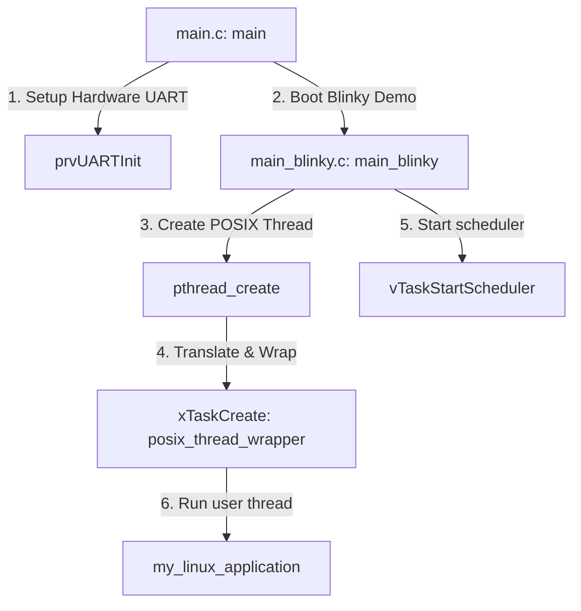

# STM32 Simulated Linux: Codebase & Architecture Overview

This document provides a comprehensive walkthrough of the directory structure, file mappings, and architectural components of the **STM32 Simulated Linux** project.

---

## 1. Project Introduction

The **STM32 Simulated Linux** project acts as a **POSIX compatibility shim** running on top of **FreeRTOS**. It is designed to simulate a Linux-like execution environment on resource-constrained microcontrollers (like STM32/Cortex-M platforms). 

Instead of compiling and running a heavy-weight Linux kernel, this project maps standard Linux system/thread calls (such as `pthread_create`) directly to FreeRTOS primitives (like `xTaskCreate`). This enables embedded developers to develop, run, and debug simulated POSIX applications directly on target hardware or inside a simulated environment like **QEMU (Cortex-M3/MPS2 platform)**.

---

## 2. Directory Structure

Below is a breakdown of the repository's file system structure and the role of each directory:

| Directory/File | Type | Purpose |
| :--- | :--- | :--- |
| [FreeRTOS](FreeRTOS) | Directory | The core FreeRTOS real-time kernel codebase and demo projects. |
| ├── [Source](FreeRTOS/Source) | Directory | The FreeRTOS Kernel core source files (`tasks.c`, `queue.c`, `timers.c`, `list.c`, etc.). |
| └── [Demo](FreeRTOS/Demo) | Directory | Code templates and hardware port configurations. |
| &nbsp;&nbsp;&nbsp;&nbsp;└── [CORTEX_MPS2_QEMU_IAR_GCC](FreeRTOS/Demo/CORTEX_MPS2_QEMU_IAR_GCC) | Directory | **Active project folder** containing compile settings, linker scripts, and main application files for running in QEMU. |
| [FreeRTOS-Plus](FreeRTOS-Plus) | Directory | Supplementary libraries including the Tracealyzer snapshot/stream recorder. |
| [tools](tools) | Directory | Code formatting, testing, and offline AWS configuring utilities. |
| [README.md](README.md) | File | Brief build instructions and overview. |
| [SYSTEM_OVERVIEW.md](SYSTEM_OVERVIEW.md) | File | **This file.** A detailed guide explaining the files, folders, and inner workings of the environment. |

---

## 3. High-Level Architecture & Code Walkthrough

The simulation environment is established through three key phases: **Hardware Bindings**, the **POSIX Shim Layer**, and the **User Space Application**.



### A. Hardware Initialization & Bootstrapping (`main.c`)
Located in [main.c](FreeRTOS/Demo/CORTEX_MPS2_QEMU_IAR_GCC/main.c):
1. **Entry Point (`main`)**: Initializes CPU hardware and registers.
2. **UART Configuration (`prvUARTInit`)**: Maps the QEMU emulated MPS2 UART0 registers (starting at address `0x40004000UL`) to standard output. 
3. **`printf` Binding (`__write` or `_uart_putc`)**: Overrides the standard C library's standard output stream to feed bytes into the UART data register, redirecting outputs straight to the QEMU terminal window.
4. **Blinky vs. Full Demo**: If `mainCREATE_SIMPLE_BLINKY_DEMO_ONLY` is defined as `1`, it boots `main_blinky()`. Otherwise, it routes to `main_full()`.

### B. The POSIX Shim Layer (`main_blinky.c`)
Located in [main_blinky.c](FreeRTOS/Demo/CORTEX_MPS2_QEMU_IAR_GCC/main_blinky.c):
Instead of including the heavyweight `<pthread.h>`, we define a lightweight compatibility interface.

* **`struct thread_args`**: Wraps the target function pointer `start_routine` and its argument `arg` so they can be securely passed through FreeRTOS's task creation utility.
* **`posix_thread_wrapper`**: A FreeRTOS task function wrapper. It extracts the routine arguments, executes the Linux application routine, and cleans up after completion by calling `vTaskDelete(NULL)`.
* **`pthread_create`**:
  ```c
  int pthread_create(pthread_t *thread, const void *attr, void *(*start_routine) (void *), void *arg)
  ```
  Translates the POSIX thread creation request into a FreeRTOS `xTaskCreate` call with a predefined stack size (1024 words) and priority (`tskIDLE_PRIORITY + 1`).

### C. The Simulated Linux Application (`main_blinky.c`)
* **`my_linux_application`**: A standard POSIX-signature function (`void* func(void*)`). It simulates a simple user-space thread executing a continuous loop, outputting print logs, and sleeping using a translated scheduler delay (`vTaskDelay(pdMS_TO_TICKS(1000))`).

---

## 4. Key Files Index

Here is a guide to the most important files you will interact with while developing this project:

### FreeRTOS Demo Environment
* **[main.c](FreeRTOS/Demo/CORTEX_MPS2_QEMU_IAR_GCC/main.c)**:
  Handles hardware setup, overrides standard memory allocation calls (`malloc`), and initializes console output via UART.
* **[main_blinky.c](FreeRTOS/Demo/CORTEX_MPS2_QEMU_IAR_GCC/main_blinky.c)**:
  Contains the POSIX compatibility layer code, thread mappings, and your active application code.
* **[FreeRTOSConfig.h](FreeRTOS/Demo/CORTEX_MPS2_QEMU_IAR_GCC/FreeRTOSConfig.h)**:
  Contains core kernel configurations, such as:
  * CPU frequency (`configCPU_CLOCK_HZ`)
  * Scheduler tick rate (`configTICK_RATE_HZ`)
  * Heap size allocation (`configTOTAL_HEAP_SIZE`)
  * Enable/disable hook functions (Idle hook, stack overflow hooks)

### Tooling and Build Chain
* **[Makefile](FreeRTOS/Demo/CORTEX_MPS2_QEMU_IAR_GCC/build/gcc/Makefile)**:
  Defines compile flags, dependencies, and target outputs. It compiles using `arm-none-eabi-gcc` and links source objects into `RTOSDemo.out`.
* **[mps2_m3.ld](FreeRTOS/Demo/CORTEX_MPS2_QEMU_IAR_GCC/build/gcc/mps2_m3.ld)**:
  The linker script for the Cortex-M3 MPS2 emulator board. It allocates memory regions:
  * **FLASH** (instruction space): starts at `0x00000000`, size `4096K`
  * **SRAM** (RAM/stack space): starts at `0x20000000`, size `8192K`
* **[startup_gcc.c](FreeRTOS/Demo/CORTEX_MPS2_QEMU_IAR_GCC/build/gcc/startup_gcc.c)**:
  Initializes MCU vector tables, sets up hardware interrupts, zeroes out memory blocks (`BSS`), and triggers the software execution by calling `main()`.

---

## 5. Development Lifecycle (How to Build & Run)

### Prerequisites
To build and run this emulator configuration, you need:
1. **ARM Toolchain**: `arm-none-eabi-gcc` (can be installed via Homebrew `brew install osx-cross/arm/arm-none-eabi-gcc` or `arm-gcc-bin@10`).
2. **QEMU System Emulator**: `qemu` (can be installed via `brew install qemu`).
3. **Make Utility**: Standard GNU `make`.

### Compilation
To compile the workspace binaries, run the following command in your terminal:
```bash
make -C FreeRTOS/Demo/CORTEX_MPS2_QEMU_IAR_GCC/build/gcc clean all
```
This builds and places the resulting executable `RTOSDemo.out` in the `output/` directory.

### Emulation
To run the built image in QEMU:
```bash
qemu-system-arm -machine mps2-an385 -cpu cortex-m3 -kernel FreeRTOS/Demo/CORTEX_MPS2_QEMU_IAR_GCC/build/gcc/output/RTOSDemo.out -monitor none -nographic -serial stdio
```
This boots the simulated device. You will see output printed to your terminal:
```text
--- Booting Simulated Linux Environment ---
Thread translated successfully.
[Linux App] Hello from POSIX thread! Counter: 0
[Linux App] Hello from POSIX thread! Counter: 1
```
*(To exit the QEMU emulator console, press `Ctrl + A`, then release and press `X`)*.
