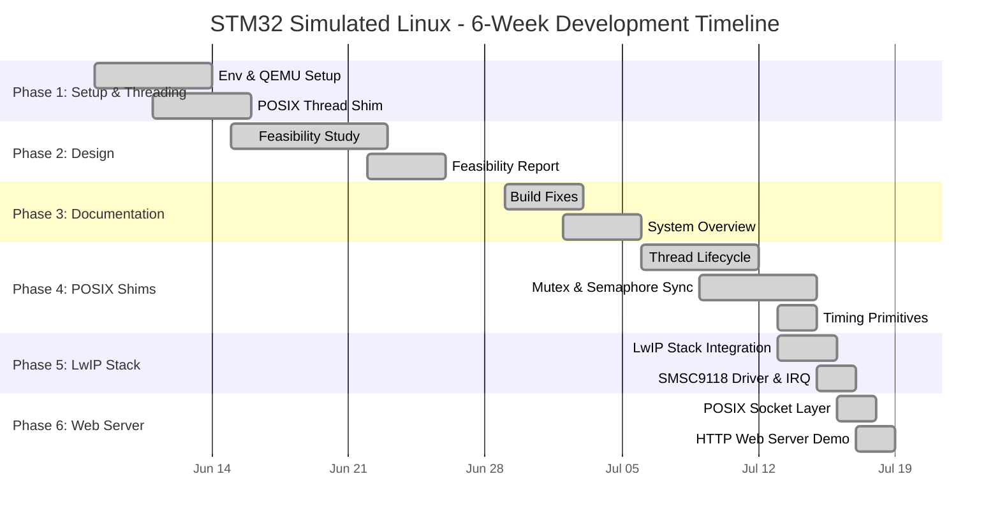

# Project Gantt Chart: STM32 Simulated Linux

This document presents a 6-week Gantt chart and project timeline detailing the development of the **STM32 Simulated Linux** compatibility layer on top of FreeRTOS running in QEMU.

The timeline spans **June 8, 2026 to July 19, 2026**, covering the initial workspace bootstrap, architectural planning, compatibility shim implementation, LwIP TCP/IP stack integration, and the demonstration of the simulated POSIX socket HTTP web server.

---

## 1. Gantt Chart Diagram

---

## 2. Master Schedule Table

| Task ID | Phase | Full Task Name | Start Date | End Date | Duration | Key Outputs / File References |
| :---: | :--- | :--- | :---: | :---: | :---: | :--- |
| **t1** | Phase 1 | Initial QEMU & FreeRTOS Environment Setup | 2026-06-08 | 2026-06-14 | 7 days | QEMU UART redirection in [`main.c`](file:///c:/Users/Alok%20Jain/Desktop/STM32/STM32-Simulated-Linux/FreeRTOS/Demo/CORTEX_MPS2_QEMU_IAR_GCC/main.c) |
| **t2** | Phase 1 | Basic POSIX Thread Translation Shim | 2026-06-11 | 2026-06-16 | 6 days | `pthread_create` mapping to `xTaskCreate` |
| **t3** | Phase 2 | Research & Feasibility Study | 2026-06-15 | 2026-06-23 | 9 days | Evaluation of Cortex-M3 memory budget & POSIX subset |
| **t4** | Phase 2 | Feasibility Report & Heatmap Creation | 2026-06-22 | 2026-06-26 | 5 days | Feasibility report and compatibility evaluation |
| **t5** | Phase 3 | Build Fixes & Type Casting Debug | 2026-06-29 | 2026-07-03 | 5 days | Toolchain build fix & Makefile adjustments |
| **t6** | Phase 3 | System Overview & Architecture Overview | 2026-07-02 | 2026-07-06 | 5 days | Architectural guide in [`SYSTEM_OVERVIEW.md`](file:///c:/Users/Alok%20Jain/Desktop/STM32/STM32-Simulated-Linux/SYSTEM_OVERVIEW.md) |
| **t7** | Phase 4 | Thread Lifecycle (`pthread_join`, `exit`, `detach`, `self`) | 2026-07-06 | 2026-07-12 | 7 days | Thread registry & lifecycle management in [`main_blinky.c`](file:///c:/Users/Alok%20Jain/Desktop/STM32/STM32-Simulated-Linux/FreeRTOS/Demo/CORTEX_MPS2_QEMU_IAR_GCC/main_blinky.c) |
| **t8** | Phase 4 | Mutex & Counting Semaphore Synchronization | 2026-07-09 | 2026-07-15 | 7 days | `pthread_mutex_t` & custom counting semaphore `sem_t` |
| **t9** | Phase 4 | Timing Primitives (`sleep`, `usleep`) | 2026-07-13 | 2026-07-15 | 3 days | Timing mapping to `vTaskDelay` ticks |
| **t10** | Phase 5 | LwIP TCP/IP Stack Integration | 2026-07-13 | 2026-07-16 | 4 days | LwIP OS layer adaptation in [`sys_arch.c`](file:///c:/Users/Alok%20Jain/Desktop/STM32/STM32-Simulated-Linux/FreeRTOS/Demo/CORTEX_MPS2_QEMU_IAR_GCC/sys_arch.c) |
| **t11** | Phase 5 | SMSC9118 Ethernet Driver & NVIC Interrupts | 2026-07-15 | 2026-07-17 | 3 days | Hardware Ethernet driver in [`ethernetif.c`](file:///c:/Users/Alok%20Jain/Desktop/STM32/STM32-Simulated-Linux/FreeRTOS/Demo/CORTEX_MPS2_QEMU_IAR_GCC/ethernetif.c) |
| **t12** | Phase 6 | POSIX Socket Shim Wrapper Layers | 2026-07-16 | 2026-07-18 | 3 days | Socket API mapping (`socket`, `bind`, `listen`, `accept`) |
| **t13** | Phase 6 | HTTP Web Server Demo Application | 2026-07-17 | 2026-07-19 | 3 days | Full POSIX web server listening on port 80/8080 |

---

## 3. Detailed Week-by-Week Breakdown

### Week 1 (June 8 - June 14, 2026): Initial Bootstrap & Threading Shim
* **Focus**: Setting up the development sandbox and verifying that FreeRTOS runs correctly under QEMU emulation.
* **Key Tasks**:
  * Imported the FreeRTOS real-time kernel and the template configuration for the Cortex-M3 MPS2 AN385 platform.
  * Overrode CPU standard output bindings in [main.c](file:///c:/Users/Alok%20Jain/Desktop/STM32/STM32-Simulated-Linux/FreeRTOS/Demo/CORTEX_MPS2_QEMU_IAR_GCC/main.c) to pipe debug text prints directly to the QEMU terminal window via the emulated UART0 controller registers.
  * Designed the initial lightweight `pthread_create` translation to FreeRTOS `xTaskCreate` task calls using dynamic memory allocations (`pvPortMalloc`) to pass startup routines.

### Week 2 (June 15 - June 21, 2026): Architectural Design & Research
* **Focus**: Analyzing the feasibility of mapping a full POSIX subset to standard FreeRTOS.
* **Key Tasks**:
  * Evaluated memory constraints of the virtual STM32/Cortex-M3 board.
  * Mapped mapping conventions, priority scaling, and stack depth allocations needed for simulating Linux threads inside a micro-kernel environment.
  * Formulated a strategy for synchronization primitives that does not require standard Unix `<pthread.h>` or `<semaphore.h>` libraries.

### Week 3 (June 22 - June 28, 2026): Feasibility Report & Heatmap Creation
* **Focus**: Consolidating findings and defining standard APIs.
* **Key Tasks**:
  * Documented the results of the feasibility research and compatibility mapping (created the initial project reports).
  * Outlined the shim capabilities, mapping priorities, and compatibility scores (heatmap) for POSIX API coverage.
  * Prepared initial build instructions for the workspace in [README.md](file:///c:/Users/Alok%20Jain/Desktop/STM32/STM32-Simulated-Linux/README.md).

### Week 4 (June 29 - July 5, 2026): Tooling & Documentation Setup
* **Focus**: Addressing compiler compatibilities and documenting architecture.
* **Key Tasks**:
  * Fixed type-casting constraints inside `pthread_create` to prevent toolchain warnings/failures.
  * Adjusted compiler flags in the Makefile and resolved system definitions to support compiling the binary.
  * Created [SYSTEM_OVERVIEW.md](file:///c:/Users/Alok%20Jain/Desktop/STM32/STM32-Simulated-Linux/SYSTEM_OVERVIEW.md) to serve as a comprehensive codebase map of the emulation setup, directory layouts, and execution pathways.

### Week 5 (July 6 - July 12, 2026): POSIX Shim Expansion
* **Focus**: Implementing robust thread lifecycle controls and locking primitives.
* **Key Tasks**:
  * Implemented lifecycle APIs in [main_blinky.c](file:///c:/Users/Alok%20Jain/Desktop/STM32/STM32-Simulated-Linux/FreeRTOS/Demo/CORTEX_MPS2_QEMU_IAR_GCC/main_blinky.c) including:
    * `pthread_join`: Blocking mechanism utilizing FreeRTOS event notifications to await thread termination and extract return states.
    * `pthread_exit` / `pthread_detach`: Automatic cleanup registry bindings to safely reclaim stack memories.
    * `pthread_self`: Context retrieval queries.
  * Integrated Mutual Exclusion locks (`pthread_mutex_t`) mapping directly to FreeRTOS Mutex structures (`xSemaphoreCreateMutex`).
  * Created a counting semaphore library (`sem_t`) to bridge missing system libraries.

### Week 6 (July 13 - July 19, 2026): Networking Stack & Sockets Web Server
* **Focus**: Integrating TCP/IP protocols and presenting the end-to-end POSIX demo.
* **Key Tasks**:
  * Integrated LwIP stack source files with custom memory parameters tuned in [lwipopts.h](file:///c:/Users/Alok%20Jain/Desktop/STM32/STM32-Simulated-Linux/FreeRTOS/Demo/CORTEX_MPS2_QEMU_IAR_GCC/lwipopts.h).
  * Built the adaptation bridge [sys_arch.c](file:///c:/Users/Alok%20Jain/Desktop/STM32/STM32-Simulated-Linux/FreeRTOS/Demo/CORTEX_MPS2_QEMU_IAR_GCC/sys_arch.c) mapping LwIP threads/semaphores directly to FreeRTOS scheduler functions.
  * Coded the SMSC9118 (LAN9118) Ethernet hardware driver in [ethernetif.c](file:///c:/Users/Alok%20Jain/Desktop/STM32/STM32-Simulated-Linux/FreeRTOS/Demo/CORTEX_MPS2_QEMU_IAR_GCC/ethernetif.c) to handle physical frames.
  * Configured interrupt routines (NVIC IRQ 13) to process incoming packet queues asynchronously via a dedicated receiver task.
  * Mapped standard Linux BSD sockets (`socket`, `bind`, `listen`, `accept`, `read`, `write`, `close`) to LwIP.
  * Developed a simulated POSIX HTTP Web Server daemon inside [main_blinky.c](file:///c:/Users/Alok%20Jain/Desktop/STM32/STM32-Simulated-Linux/FreeRTOS/Demo/CORTEX_MPS2_QEMU_IAR_GCC/main_blinky.c) listening on virtual port 80 (forwarded to host port 8080) responding to HTTP GET requests.
